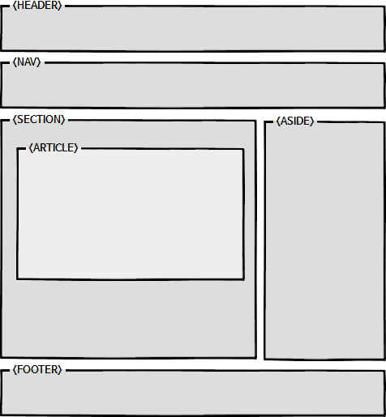

# HTML 정리

1. HTML 기본태그

Aria 태그 정의

```html
<a href="https://developer.mozilla.org/ko/docs/Web/Accessibility/ARIA"
  >Aria 태그 정의</a
>
```

```html
<!DOCTYPE html> html타입 선언 (시작할때 넣을것)
<meta name="viewport(메타데이터 종류)" content="width=device-width, initial-scale=1.0(메타데이터 값)"> 문서 자체의 특성
<meta name="author(메타데이터 작성자)" content="이경섭">
<meta charset = "utf-8"> 한글안깨지게할때 넣는것
<meta name="keywords(브라우저 서치할때 서치하게 나오게하는것)" content="김버그, 구름강의, 구름Edu">
<meta name="description(페이지설명)" content="~~~">
<title> 브라우저 표시되는 제목(html 문서의 대 제목)
<html> 기본html 태그
<head> html 설정
<body> Html 본문
<style></style> html안에 css 코드를 사용할때(거의 사용안함)

```

## 하이퍼링크

```html
<a target="_blank"> 하이퍼 링크 다른창으로 열때</a>
<a title=""> 커서를 올려놨을때 뜨는 내용 </a>
<a href="url"> 하이퍼 링크</a>
<a href="mailto:메일주소"> 메일 쓰기</a>
<a href="tel:전화번호"> 전화 걸기</a>
```

## 태그

```html
<p>
  단락 <br />
  줄바꿈
</p>

<h1>제목 (자동줄바꿈)</h1>
<li>list 준말</li>
<ol>
  oredered list 준말 (숫자) 자식으로는 list 태그밖에 올수없다
</ol>
<ul>
  unodered list 준말 (점) 자식으로는 list 태그밖에 올수없다
</ul>

<audio
  src="오디오 태그"
  controls="재생 소리조절기"
  autoplay="사이트키면자동재생(크롬은막음)"
  loop="반복"
></audio>
<audio>
  <source src="mp3 wav ogg" type="audio/mpeg audio/wav audio/ogg" />
</audio>
<video>오디오태그랑 사용방법 같음</video>
<video><source src="mp4 mov" type="video/mp4로 통일" /></video>
<iframe>html문서안에 또다른 html을 사용할때</iframe>
<abbr title="약자의 풀네임">abbreviaton의 약자 약자의 뜻</abbr>
<address>연락처 태그(물리적주소 , url , email , 전화번호 , sns)</address>
<code
  >대부분 pre 태그안에 넣어서 사용 html에서 육안으로 파악가능하게
  코드입력할때</code
>
<pre>html 문서상 코드를 작성하고 싶을때 사용</pre>
<table>
  table 태그 border 로 선을 나타낼수 있음
  <thead></thead>
  <tbody></tbody>
  <tfoot></tfoot>
  <tr>
    table row 약자 (행)
    <th
      rowspan="크기(세로병합)"
      colspan="크기(가로병합)"
      scope="col,row thead에만 쓸수있고 가로헤더인지 세로헤더인지 인지시키는 것"
    >
      table header 약자
    </th>
    <td>table data 약자</td>
  </tr>
</table>

<label>
  요소는 브라우저에 의해 일반적인 텍스트로 랜더링되지만, 사용자가 마우스로 해당
  텍스트를 클릭할 경우요소와 연결된 요소를 곧바로 선택할 수 있어 사용자의
  편의성을 높일 수 있습니다.
</label>
<font> 글씨 바꾸는 태그 (잘안씀)</font>
<p attr="value">
  태그하나만으로는 표현을 충분히 못할경우 부가적으로 태그의 성격을 디테일하게
  주고싶을때 사용(추가적인 정보를 제공)
</p>
<strong>강조하고싶은태그(bold)</strong>
<em>강조하고싶은태그(기울기)</em>

<!--용어를 정의할때 사용하는 정의리스트 key-value(~는~)로 정보를 제공할때
    dl의 자식요소는 오직 div, dt, dd만 가능하다-->

<dl>Description List</dl>
<dt>Description term</dt>
(key 값 정의)
<dd>Description data</dd>

<!--인용 Quotations-->
<blockquote cite="url">
  문단자체를 인용하는경우(q태그보다 더 많이 사용)
  <cite>인용의 출처가 text로 되어있을경우 </cite>
</blockquote>
<q>문단에서 특정한부분을 인용할때 사용하는태그</q>

<script src="경로"></script>
<script>
  자바 스크립트 코드(body 태그안에서도 가장 나중에 쓰는것이 좋다.)
</script>
```

## [의미론적 태그](https://webdir.tistory.com/310)



목적
문서의 정보를 보다 잘 표현하기 위해서는 의미에 맞는 태그를 잘 사용해야 합니다. 특히 HTML5에서는 웹페이지에서 통상 많이 사용하는 구조에 의미를 분명히 부여하기 위해서 의미론적 태그(semantic element)를 새롭게 정의해서 제공하고 있습니다. 그 목록은 아래와 같습니다.
| section | 문서의 구획들을 정의 (애매한것에 사용) &lt;h1 &gt;태그 필수사용|
|---------|-----|
| header | 화면의 상단에 위치하는 사이트나 문서의 전체적인 정보를 정의 |
| footer | 화면의 하단에 위치하는 사이트나 문서의 전체적인 정보를 정의 |
| aside | 광고와 같이 페이지의 내용과는 관계가 적은 내용들 &lt;h1 &gt;태그 필수사용|
| main | 문서에서 가장 중심이 되는 컨텐츠를 정의 문서에 한번만 사용가능|
| article | 본문 &lt;h1 &gt;태그 필수사용|
| nav | 문서의 네비게이션 항목을 정의 &lt;h1 &gt;태그 필수사용|
| details | 기본적으로 표시되지 화면에 표시되지 않는 정보들을 정의 |
| figure | 삽화나 다이어그램과 같은 부가적인 요소를 정의 |
| mark | 참조나 하이라이트 표시를 필요로 하는 문자를 정의 |
| time | 시간을 정의 |

## form

```html
<form action="api주소" method="post/get">
  입력양식
  <input
    type=""
    name="type의 이름"
    value="type의 기본적으로 들어가있는 속성값"
    method="post , get"
    enctype="multipart/form-data"
    file="업로드 하는 기능이 하나라도 있을경우 사용 할 것"
    placeholder="박스에 요청하는것 적기"
    maxlength="입력할수있는 최대길이"
    minlength="입력할수있는 최소길이"
    max="최대값"
    min="최소값"
    required="필수로 입력해야하는 것"
    disabled="사용할수없게 막아놓는 것"
    accept="확장자 지정"
  />
</form>
```

입력하는 태그 type 으로 상황에따라 적용

method = "post = url 아닌 방식 으로 값을 숨겨서 보냄(대부분 사용) get = url
통해서 뒤에 값을 표시한채 보냄 "

type = text : text 형식
password : password 형식 텍스트가 가려져서 보임
textarea : text구역 (cols ="" colum의 준말 크기 rows="" 문자줄 value 사용 x
)
button : 그냥 버튼 value 로 버튼안에 내용 변경가능
reset : form 태그 안에 내용 초기화
hidden : UI 는 없지만 서버로 어떤값을 전송하고 싶을떄 사용하는 타입
file : 파일선택하는 타입 name ="" 쓸것

## Dropdown

```html
<selct name="" (multple 다중선택) />
<option value="보낼 옵션 값">select 선택문안에 값설정</option>
<form>
  <input type="radio" name="radio그룹이름" value="전달할 값" />
  <input type="checkbox" name="checkbox그룹이름" value="전달할 값" />
</form>
```

# css

Cascading Style Sheet의 준말 html페이지를 꾸미기 위한언어

selector(선택자) {
property(선언): value(값);
}

vw = viewport width
vh = viewport height

## Boxmodel

| Content       | 가로는 width 세로는 height                                           |
| ------------- | -------------------------------------------------------------------- |
| Padding       | 안쪽 여백, 즉 content와 border 사이의 공간을 나타내는 Padding        |
| Border        | 테두리를 나타냄 (굵기 스타일 색상이 있어야함) 필요없을경우 none 사용 |
| border-radius | 둥근 테두리가 필요할때                                               |
| margin        | 바깥여백, 즉 요소와 요소사이의 간격을 나타내는 margin                |

## display

| Block(길막)  | 다른 블록이 침범하지못하게 width값 남은곳은 margin이 자동으로 채움                                       |
| ------------ | -------------------------------------------------------------------------------------------------------- |
| Inline(흐름) | width,height, padding-top, padding-bottom, border-top, border-bottom, margin-top, margin-bottom 사용불가 |
| Inline-block | Inline 장점과 Block 장점을 합친것                                                                        |
| none         | 요소가 존재하지 않게됨                                                                                   |

### flexbox : 정렬의 끝판왕(float대용)

| flex                                               | 부모한테 선언 - 가로 정렬 세로 정렬 정하기 - 한 줄 안에 다 정렬할껀지 - flexbox (a 태그안에있는 텍스트들도 자식으로 포함)시작  |
| -------------------------------------------------- | ------------------------------------------------------------------------------------------------------------------------------ |
| flex-direction                                     | 정렬방향 선언 가로 - row , 세로 - column                                                                                       |
| Axis                                               | flex 사용시 보이지 않는 축 선언에 따라 달라짐                                                                                  |
| main-Axis(justify-content)                         | center , space-around, space-between ,flex-start, flex-end                                                                     |
| cross-Axis(align-items, align-content(wrap인경우)) | center , space-around, space-between ,flex-start, flex-end                                                                     |
| flex-wrap                                          | 한줄안에 정렬 할 경우 nowrap(자식의 사이즈를 줄여서 라도 한 줄로 정렬해버리는 명령어), wrap(사이즈를 줄이지않고 여러줄로 생성) |
| order (순서부여)                                   | order: 1 , order: 2,order:3                                                                                                    |

## Float

| float          | 사용시 block으로 변경 이때 block은 길막 x                              |
| -------------- | ---------------------------------------------------------------------- |
| opacity        | 투명도 1, 0.5, 0                                                       |
| Clearfix       | float로 고장난거 고칠떄 사용 clear는 left, right, both를 사용          |
| Pseudo Element | css가상요소 html에는 존재하지않음 .class::before .class::after 로 사용 |

## Position

| static   | 모든요소의 기본포지션값                                                                    |
| -------- | ------------------------------------------------------------------------------------------ |
| relative | 이동의 기준점은 자기가 본래있던 위치 다른요소에게 영향을 안줌                              |
| absolute | diplay값이 block으로 변경됨 길막x (float랑 비슷함) 기준점이 가장중요(relative가 가장 적절) |
| fixed    | absolute랑 동일한 현상이 일어남 viewport 사이즈가 기준이됨                                 |
| z-index  |                                                                                            |

## Media Query

viewport meta : html에서 사용

```html
<meta name="viewport" />
```

media query : css

```css
@media screen and (min-width: 768px) {
  /* 코드 작성 */
}
```

## Typography

- 텍스트를 이쁘게 디자인(대부분 텍스트로 되어있음)

| Typography      | 텍스트를 이쁘게 디자인(대부분 텍스트로 되어있음)                                                           |
| --------------- | ---------------------------------------------------------------------------------------------------------- |
| font-size       | 글씨의 크기를 나타냄 ex) px 픽셀(절대단위) em 실제로 적용된 폰트사이즈 1em(상대단위) rem html em(상대단위) |
| line-height     | 줄간격 px em을 가장많이사용 rem 에사용 / 줄간격 가운데의 위치                                              |
| letter-spacing  | 글자와 글자사이의 간격크기 px,em(가장많이사용)을 사용                                                      |
| font-famliy     | 폰트서체를 설정할때 사용 serif(명조체) seans-serif(고딕)                                                   |
| font-weight     | 폰트의 굵기를 나타냄 (100단위) 400(regular) 700(bold)                                                      |
| color           | 폰트 색상 hex(#fff) rgb (0,0,0) rgba(0,0,0,1 투명도)                                                       |
| text-align      | 폰트 정렬 left right center                                                                                |
| text-indent     | 텍스트 들여쓰기                                                                                            |
| text-transform  | 알파벳 변형 none, capitalize(다음단어시작 대문자), uppercase(전부대문자), lowercase(전부소문자)            |
| text-decoration | 텍스트 줄을 긋는거 none, underline(밑줄생성), line-through, overline(위에 선생성)                          |
| font-style      | 문자가 기울어질 경우 normal, italic(많이사용), oblique(거의 사용x)                                         |

## Webfont

- 갖다 쓰는방법

[폰트저장소](https://fonts.google.com) 에서 가져와서 사용

- 직접 제공하는 방법
  다운받아서 직접제공

  import를 html or css에 import 해야함

```html
<link rel="stylesheet" href="./font.css" />
```

```css
@import url('./font.css');
```

- 폰트 사용하기 쉽게 설정

  ```css
  @font-face {
    font-family: '';
    font-style: normal;
    font-weight: 400;
    src: url('폰트경로.eot'); /* IE9 Compat Modes */
    src: url('폰트경로.eot?#iefix') format('embedded-opentype'), /* IE6-IE8 */
        url('폰트경로.woff2') format('woff2'),
      /* Super Modern Browsers */ url('폰트경로.woff') format('woff'), /* Pretty Modern Browsers */
        url('폰트경로.ttf') format('truetype'),
      /* Safari, Android, iOS */ url('폰트경로.svg#svgFontName') format('svg'); /* Legacy iOS */
  }
  ```

  ## [background](https://unsplash.com)

  | background          | 배경                                                                                                                        |
  | ------------------- | --------------------------------------------------------------------------------------------------------------------------- |
  | background-color    | hex rgb rgba                                                                                                                |
  | background-image    | 배경으로 이미지 넣을때 반드시 url()사용                                                                                     |
  | background-repeat   | 사진반복 repeat, 사진반복x no-repeat                                                                                        |
  | background-size     | 배경사진의 사이즈 contain(요소안에 모든이미지 공간이 남더라도 포함), cover(요소안에 빈공간을 남기지않고 꽉채울경우), custom |
  | background-position | 사진을 위치시킬경우 center, bottom, top, left, right 사용                                                                   |

  ## Transition

  - 어떤 요소의 속성값을 바꿀때 사용

| Transition      | 어떤 요소의 속성값을 바꿀때 사용                                                                                            |
| --------------- | --------------------------------------------------------------------------------------------------------------------------- |
| property        | css속성을 뜻함                                                                                                              |
| duration        | 지속시간 ms(1000ms = 1s) s 초                                                                                               |
| timing-function | 생략가능, 변화의 속도(ease-in(천천히 바뀌다가 빠르게), ease-out(빠르다가 천천히), ease-in-out, cubic-bezier()변화속도 설정) |
| delay           | 지연시킬때 몇초후에 변화시키려고 할때 사용                                                                                  |

## [animation](https://developer.mozilla.org/ko/docs/Learn/CSS/First_steps)

| animation-property | 속기형인 animation을 쪼개서 사용                                                                                            |
| ------------------ | --------------------------------------------------------------------------------------------------------------------------- |
| name               | @keyframes로직이름{from{시작할때} to{마지막}}, @keyframes로직이름{0%{} 50%{} 100%{}}                                        |
| duration           | 지속시간 ms(1000ms = 1s) s 초                                                                                               |
| timing-function    | 생략가능, 변화의 속도(ease-in(천천히 바뀌다가 빠르게), ease-out(빠르다가 천천히), ease-in-out, cubic-bezier()변화속도 설정) |
| delay              | 지연시킬때 몇초후에 변화시키려고 할때 사용                                                                                  |
| iteration-count    | 반복횟수 설정 정수를 적거나 infinite(무한)                                                                                  |
| direction          | 애니메이션 진행될때 진행되는 방향 alternate(번갈아가다)                                                                     |

## etc

### [box-shadow]{https://neumorphism.io/#e0e0e0}

| box-shadow | 박스 그림자       |
| ---------- | ----------------- |
| h-offset   | x축 이동시킬 거리 |
| v-offset   | y축 이동시킬 거리 |
| blur       | 흐린 정도         |
| spread     | 그림자 사이즈     |
| color      | 색상              |

### Opacity

- 투명도 : 0일수록 투명 1일수록 불투명

### Overflow

| Overflow    | width or height의 크기를 넘어갔을경우 작용하는 개체               |
| ----------- | ----------------------------------------------------------------- |
| visible     | Overflow의 기본값                                                 |
| auto,scroll | 넘어갔을때 알아서 해라 auto , 넘어갔을떄 스크롤로 만들어라 scroll |
| hidden      | 넘어갔을경우 숨길때 사용                                          |

### Transform

| translate() | translate(x,y) 내가 원하는 방향으로 위치시키고 싶을때 사용 다른애들한테 영향안줌            |
| ----------- | ------------------------------------------------------------------------------------------- |
| scale()     | scale() 숫자의 배율만큼 크기를 키운다 scale(x,y) x는 width y는 height 배율만큼 크기조절     |
| rotate()    | rotate(Ndeg) 각도를 돌려줄때사용 괄호안에 숫자와 deg를 같이적어야함 ex) 90도 돌릴라면 90deg |

### Visibility

| Visibility | 요소를 보이게 할때 사용 보이지만 않는것 위치는 그대로 가지고있음(opacity:0과 비슷한 예시) |
| ---------- | ----------------------------------------------------------------------------------------- |
| visible    | 기본값 요소를 보일때 사용                                                                 |
| hidden     | 요소를 숨길때 사용                                                                        |

## 동적 가상 클래스 선택자(User action pseudo-classes)

- User의 액션에 따라 사용

| element:hover  | 마우스를 갖다 댔을때       |
| -------------- | -------------------------- |
| element:focus  | 눌러서 focusing이 되었을때 |
| element:active | 마우스를 눌렀을때          |
